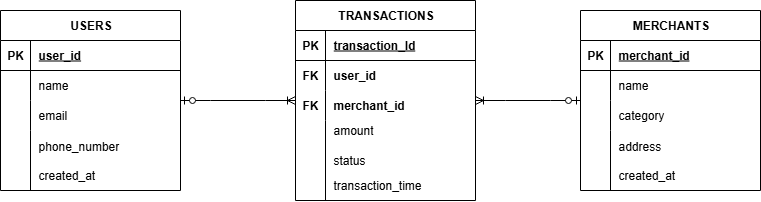

# Data Engineering Assessment (DEA) Solution

This document serves as the comprehensive final documentation for the technical assessment, covering data modeling, ETL implementation, and best practices.

## 1. Project Overview, Setup, and Execution Instructions

### 1.1 Core Architecture and Dependencies

The solution establishes a modern ELT stack where **MySQL** is the transactional source and **ClickHouse** is the analytical data warehouse. All code is executed within the Dockerized `etl_service`.

| Dependency | Purpose |
| :--- | :--- |
| **`pandas`** | Data transformation and manipulation. |
| **`mysql-connector-python`** | Programmatic connection to the MySQL Source. |
| **`clickhouse-driver`** | Programmatic bulk data loading to ClickHouse. |
| **`pymongo`** | Programmatic connection to the MongoDB Source. |
| **`dagster`, `dagster-webserver`** | Orchestration framework for future integration. |
| **`pytest`** | Unit testing for transformation logic. |

### 1.2 Setup and Running Instructions

The entire environment is containerized. All services are run once via Docker Compose.

| Step | Action | Command |
| :--- | :--- | :--- |
| **1. Build & Run Stack** | Builds the ETL service and starts all containers. | `docker compose up --build -d` |
| **2. Execute MySQL DDL & Seed** | Creates Source Schema, Checkpoint Table, and populates initial data. | `type DDL-MySQL-Source.sql | docker exec -i clickhouse-mysql_source-1 mysql -u root -prootpassword ewallet_source` |
| **3. Execute ClickHouse DDL** | Creates the Destination Star Schema and CDC table. | `type DDL-Clickhouse.sql | docker exec -i clickhouse-clickhouse-1 clickhouse-client -u default --password defaultpassword --database=analytics_dw --multiquery` |
| **4. Run CDC Simulation** | Executes the CDC stream simulation code. | `python cdc-stream.py` |
| **5. Run ETL Pipeline (Initial/Incremental)** | Executes the main ELT job inside the Docker container. | *Handled by `docker compose up` in the `etl_service` CMD* |

### 1.3 How to Run ETL for Full vs. Incremental Loads

The core `etl_pipeline.py` script is designed to run the **Incremental Load** by default using a MySQL `checkpoint` table.

| Run Mode | Action Required (Manual Setup via MySQL Client) | Command (MySQL) |
| :--- | :--- | :--- |
| **Full Load** (Run 1) | **Reset the watermark** to force a full data pull. | `UPDATE checkpoint SET last_synced_at = '1970-01-01 00:00:00' WHERE pipeline_name = 'transactions_elt';` |
| **Incremental Load** (Run N) | Load new data, relying on the automatically updated timestamp. | *No manual update needed. Pipeline uses existing `last_synced_at`.* |

***

## 2. Assumptions and Design Choices

### 2.1 Core Assumptions

* **Implementation Focus:** All practical ETL implementation, seeding, and querying is focused on the **MySQL Source**. MongoDB is addressed only conceptually.
* **Orchestration:** The ETL is currently triggered *ad-hoc* via Docker's `CMD` entry point, simulating a job. Full Dagster integration is reserved for the next phase of development.
* **Data Quality:** Only transactions with `status = 'SUCCESS'` are loaded into the analytical `fact_sales` table.

### 2.2 Project Structure and Code Quality (Q5.a)

* **Code Modularity:** Logic is separated into distinct modules (`etl_pipeline.py`, `cdc-stream.py`, `test_etl_logic.py`).
* **Best Practices:** All execution scripts utilize Python's **`logging`** module for structured *traceability* and feature error handling (specific MySQL/ClickHouse exceptions).
* **Dockerization:** The ETL code is packaged into the **`python_etl_pipeline:latest`** Docker image, ensuring portability and consistent dependencies.

---

---

## 2\. Solution for Section 1: Data Modeling & Query Design

### 2.1 ERD Design and Relational Logic

The source schema follows **Third Normal Form (3NF)** for operational integrity.

  * **Entity Relationship Diagram (ERD):**

    

  * **Relationship Logic:** All relationships are **One-to-Many Mandatory** from the dimension tables (`USERS`, `MERCHANTS`) to the fact table (`TRANSACTIONS`).

      * **Enforcement:** This is enforced by applying **`NOT NULL`** constraints on the Foreign Key columns in the `transactions` table (MySQL DDL), guaranteeing that every transaction *must* be linked to a registered User and Merchant.

  * **Attribute Choices:**

      * `transaction_id` is **VARCHAR** to support **UUIDs/alphanumeric identifiers** crucial for distributed *fintech* systems.
      * `amount` is **DECIMAL(10, 2)** to maintain **strict financial precision** at the source.

### 2.2 ClickHouse Destination Schema (OLAP)

The destination schema uses a **Star Schema** model, optimized for high-speed analytical queries.

| Feature | MySQL (Source - OLTP) | ClickHouse (Destination - OLAP) |
| :--- | :--- | :--- |
| **Model** | 3NF (Normalized) | **Star Schema** (Denormalized) |
| **Primary Key** | Natural Key (`user_id`, `merchant_id`) | **Surrogate Key** (`user_key`, `merchant_key`) |
| **Optimized Partitioning** | None (Focus on writes) | Uses **`PARTITION BY transaction_date`** to accelerate time-range queries. |

-----

### 2.3 Data Mapping and Transformation Strategy

The process utilizes an **ELT** workflow, mapping and transforming data for analytical efficiency.

  * **Relational Source (MySQL) to ClickHouse:**
    I would transform OLTP MySQL Data into Clickhouse OLAP Data by using Incremental Load mechanism where Python scripts utilize a watermark, like created_at 
    attribute to only pull new or updated records. Before loading them into the fact_sales table, I would perform denormalization by replacing the transactional
    primary keys (user_id, merchant_id) with Surrogate Keys. The transaction_time attributes also split into two in fact_sales to become transaction_time
    (DateTime) and transaction_date (Date) so the analytical queries in Clickhouse become a faster process.

  * **Non-Relational Source (MongoDB) to ClickHouse (Conceptual):**
    I would extract non-relational data using pymongo driver. I use Python script to convert the JSON structured data into rows and columns, after that the
    converted data is loaded into a Fact table in ClickHouse, the Python script will also include data validation in order to ensure data quality before loading,
    so the data remain consistent and could be analyzed in a data warehouse like Clickhouse.

-----

### 2.4 Querying

The analytical queries provided below are executed against the ClickHouse Star Schema to derive key business metrics. (Queries are provided in `Querying_Total_Transaction_Merchant.sql` and `Querying_Total_Transaction_Merchant.sql` files).

**Query 1: Total Transaction Amount per User per Day**

```sql
SELECT
    t2.name AS user_name,
    t1.transaction_date,
    SUM(t1.amount) AS total_daily_spending
FROM
    analytics_dw.fact_sales t1
LEFT JOIN
    analytics_dw.dim_users t2 ON t1.user_key = t2.user_key
WHERE
    t1.status = 'SUCCESS'
GROUP BY
    user_name,
    t1.transaction_date
ORDER BY
    t1.transaction_date,
    user_name;
```

**Query 2: Total Transactions per Merchant**

```sql
SELECT
    t2.name AS merchant_name,
    t2.category,
    COUNT(t1.transaction_id) AS total_transaction_count
FROM
    analytics_dw.fact_sales t1
LEFT JOIN
    analytics_dw.dim_merchants t2 ON t1.merchant_key = t2.merchant_key
WHERE
    t1.status = 'SUCCESS'
GROUP BY
    merchant_name,
    category
ORDER BY
    total_transaction_count DESC;
```

---

## 3. Solutions for ETL Pipeline and Incremental Processing

This section details the implementation of the Python-based Mini-ETL Pipeline, demonstrating clear functional modularity, business logic transformation, and a  incremental loading mechanism.

### 3.1 Mini-ETL Pipeline Implementation

The core logic resides in the modular Python script, `etl_pipeline.py`. It demonstrates separation of concerns (Extract, Transform, Load) for clarity and maintainability.

| Stage | Action | Implementation in `etl_pipeline.py` |
| :--- | :--- | :--- |
| **Extract** | Pulls incremental transactional data from the MySQL source. | `extract_data()` function uses `mysql-connector-python` and the *watermark* logic. |
| **Transform** | Applies business logic for categorization and key preparation. | `transform_data()` function uses **Pandas** to: 1. **Categorize Amount** (e.g., 'High Value'). 2. **Filter** out `FAILED` transactions. 3. **Mock Surrogate Keys** for OLAP readiness. |
| **Load** | Writes transformed data to the analytical destination. | `load_data()` function uses the **ClickHouse Driver**'s `client.execute()` method for efficient bulk insertion into `fact_sales`. |

### 3.2 Incremental Load and Checkpointing

The pipeline is designed for efficiency and reliability by implementing a incremental loading mechanism.

#### Checkpointing Mechanism

* **Method:** The pipeline uses a dedicated **`checkpoint` table in MySQL** to track the last successful synchronization time. This method guarantees persistent and reliable state management between runs.
* **Tracking Logic (Code Implementation):**
    * The `get_last_watermark()` function reads the `last_synced_at` field from the checkpoint table, which acts as the **lower bound** of the extraction window.
    * The `update_watermark()` function uses an **UPSERT** statement (`INSERT ON DUPLICATE KEY UPDATE`) to atomically update the timestamp **only after a successful data load**, preventing the same batch from being missed or duplicated if a failure occurs mid-process.

#### Incremental Extraction Query

The extraction query utilizes the watermark to pull only new data:

```sql
SELECT ... FROM transactions
WHERE transaction_time > '{last_sync}'
  AND transaction_time <= '{current_run_time}' 
ORDER BY transaction_time ASC;
````

-----

### 3.3 Expected Result and Validation

The successful initial run validates the complete transformation logic by loading filtered and categorized data into ClickHouse:

| Transaction ID | User ID | Amount | Expected Amount Category | Expected Load Status |
| :--- | :--- | :--- | :--- | :--- |
| TX1001 | 1 | 50,000 | Medium Value | SUCCESS |
| TX1003 | 2 | 150,000 | High Value | SUCCESS |
| **TX1004** | 2 | 10,000 | Low Value | **FILTERED OUT (FAILED)** |
| TX1008 | 2 | 65,000 | Medium Value | SUCCESS |

**Validation:** The initial run successfully loaded **4** records (excluding the FAILED record), and the incremental test run successfully pulled and loaded **3 subsequent new records**, validating the overall **idempotent** and **incremental** design.

```
```

## 4. Solution for CDC & Streaming Simulation

This section demonstrates the understanding and implementation of Change Data Capture (CDC) principles for near real-time data processing, utilizing ClickHouse's capabilities.

### 4.1 Conceptual Understanding

* **What is CDC (Change Data Capture)?**
    I would define Change Data Capture (CDC) as a set of software patterns designed to detect and track data modifications—specifically inserts, updates, and
    deletes—occurring in a source transactional database. Instead of periodically scanning entire tables (like in a full batch load), I use CDC to read the
    database's transaction log (the commit log or binary log). This allows me to capture the changes as they happen, effectively treating the database as a 
    high-fidelity data stream. This ensures minimal latency and virtually eliminates impact on the performance of the source system.

* **When Should You Use Batch vs. CDC?**
    The decision between using Batch Processing and Change Data Capture (CDC) relies entirely on the organization's requirement for data freshness and the 
    need for auditability. I would recommend Batch Processing when the analytical goal is to process large volumes of data for historical trends or reports 
    that can tolerate latency, typically measured in hours or days. Batching is simpler to implement and places less continuous strain on the source 
    transactional database.However, I must employ CDC when there is a critical need for near real-time data freshness—meaning downstream applications, such as
    fraud detection, customer personalization, or live dashboards, must react to transactions within minutes or seconds. CDC is the superior method for 
    maintaining a truly accurate data replica because it reliably captures all three types of data change (inserts, updates, and deletes), ensuring that the
    analytical system reflects the current state of the source with minimal delay. In high-volume systems like our e-wallet, a hybrid approach is often ideal
    using CDC for critical, fast-moving tables, and leveraging efficient incremental batching for less time-sensitive facts and dimensions.

### 4.2 Streaming Simulation Implementation

The solution uses the `cdc-stream.py` script to simulate a streaming consumer, processing change events and performing an upsert operation into the destination ClickHouse table (`cdc_transactions`).

* **Simulation Strategy:** The pipeline simulates reading *change events* by consuming a **JSON array file (`cdc_events.json`)**. This acts as a reliable *stand-in* for a live Kafka stream.

* **Processing and Loading:**
    The Python script reads the JSON events, converts the *version timestamp* (`_version`) into a proper `datetime` object, and performs a **bulk load** into the `cdc_transactions` table. This table uses the **`ReplacingMergeTree` engine**, which is designed to handle *upsert* logic natively in an analytical data warehouse.

* **Handling Failures and Duplicates (Idempotency):**
    My approach to handling failures and duplication relies on a combination of application logic (Python's try/except) and the destination database's native
    features (ClickHouse's ReplacingMergeTree). For duplication and data reconciliation (Insert/Update/Delete operations), the pipeline uses the cdc_transactions
    table with the ReplacingMergeTree engine, keyed on transaction_id and versioned by the _version timestamp. This design ensures idempotency: when duplicated
    events arrive, ClickHouse automatically retains only the record with the highest _version, effectively handling upserts. A final OPTIMIZE TABLE command is
    executed to consolidate these changes. For failures during the load process, the Python script employs a robust try...except block around the critical
    ch_client.execute() statement. In a real-world Kafka environment, a failure caught here would prevent the Consumer from committing its offset, causing 
    Kafka to re-deliver the failed events on the next run, thus guaranteeing at-least-once delivery and preventing data loss.
    
-----

## 5\. Implementation of Code Quality, Dockerization and Pytest

This section details where Python best practices and production-readiness enhancements (Dockerization, Unit Tests) were applied across the existing codebase (`etl_pipeline.py`, `cdc-stream.py`).

### 5.1 Python Best Practices

Best practices were executed within the code to ensure high quality, traceability, and error handling.

#### A. Code Modularity and Logging

  * **Modularity:** The logic is strictly separated into distinct, single-responsibility functions (e.g., `extract_data()`, `transform_data()`, `load_data()`) across the pipeline.
  * **Logging:** All status outputs (`print()`) were replaced with the Python **`logging`** module (`logger.info`, `logger.error`). This provides structured **traceability** of the pipeline's start time, status, and failure points.

#### B. Error Handling

  * Specific `try...except` blocks were implemented around critical database operations:
      * **Connection Errors:** Handled initially to fail fast if MySQL or ClickHouse is unreachable.
      * **SQL/Load Errors:** Catching specific database exceptions, such as **`ClickHouseError`**, to ensure that data loss is logged and the pipeline exits gracefully.
      * **Parsing Errors:** Handled specific `ValueError` in the CDC stream to skip corrupted records without crashing the entire flow.

### 5.2 Bonus Implementation Summary

The following bonuses demonstrate readiness for a professional production environment.

#### A. Dockerization

  * **Implementation:** The entire ETL code and its Python dependencies were packaged into a dedicated Docker image and service (`etl_service`).
  * **Goal:** Guarantees that the pipeline is **portable** and runs with consistent dependencies, utilizing Docker's internal networking (e.g., using `mysql_source` instead of `localhost`).
  * **Execution Script:**
    ```bash
    docker compose up --build -d
    ```

#### B. Unit Tests

  * **Implementation File:** **`test_etl_logic.py`**.
  * **Goal:** Successfully ran **2 unit tests** using **`pytest`** to prove that the core business logic (`transform_data` function) is reliable and independent of database connections.
  * **Focus:** Testing the custom **amount categorization** and **Surrogate Key mocking** using simulated Pandas DataFrames.
  * **Execution Script:**
    ```bash
    pytest
    ```
